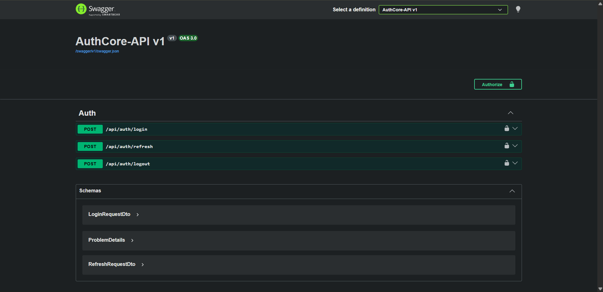

# AuthCore API

**A focused RESTful authentication service built with ASP.NET Core (.NET 10)**

AuthCore demonstrates production-aware API design decisions — JWT access tokens, rotating refresh tokens, secure revocation on logout, and consistent HTTP semantics throughout. It is intentionally minimal: the goal is depth over breadth, showing how each design choice maps directly to REST principles rather than packing in features.

---

## Live API — Swagger at Runtime



> All three endpoints (`/login`, `/refresh`, `/logout`) are fully documented via Swagger/OpenAPI and testable directly from the browser. The screenshot above is taken from a live running instance — not mocked.

---

## Why This Project

Most auth tutorials stop at "it works." This project goes further by asking *why*:

- Why does `/logout` return `204 No Content` and not `200 OK`?
- Why is the refresh token sent in the request **body** and not a cookie or header?
- Why does refreshing rotate the token instead of reusing it?

Every decision in this codebase is deliberate. The notes in this README explain those decisions.

---

## Tech Stack

| Layer | Technology |
|---|---|
| Framework | ASP.NET Core (.NET 10) |
| Auth | JWT Bearer (`Microsoft.AspNetCore.Authentication.JwtBearer`) |
| Password Hashing | BCrypt.Net-Next |
| API Documentation | Swashbuckle (Swagger / OpenAPI 3) |
| Storage | In-memory (demo scope) |

---

## Project Structure

```
AuthCore/
├── Controllers/        # HTTP surface — AuthController (thin, delegates to service layer)
├── Services/           # Auth logic — token creation, refresh rotation, revocation
├── Models/             # Domain entity (User) and DTO contracts (request/response shapes)
├── Data/               # In-memory user store (UsersData.cs)
└── Configurations/     # Swagger setup and JWT authentication registration
```

**Design note:** Controllers are deliberately thin. They validate input, call the service, and map the result to an HTTP response — nothing more. Business logic lives entirely in the service layer, which makes it independently testable.

---

## API Endpoints

Base route: `/api/auth`

---

### `POST /api/auth/login`

Authenticates a user and issues an access token + refresh token pair.

**Request body**
```json
{
  "username": "mohamedragheb",
  "password": "1234"
}
```

**Responses**

| Status | Meaning |
|---|---|
| `200 OK` | Credentials valid — tokens returned in response body |
| `401 Unauthorized` | Username not found or password mismatch |

**REST rationale:** `POST` is correct here because login is not idempotent — each call produces a new token pair with a new expiry. A `GET` would be wrong (side effects must not live on safe methods) and would expose credentials in the URL and server logs.

---

### `POST /api/auth/refresh`

Exchanges a valid refresh token for a new access token + refresh token pair. The old refresh token is immediately invalidated (rotation).

**Request body**
```json
{
  "username": "mohamedragheb",
  "refreshToken": "<current-refresh-token>"
}
```

**Responses**

| Status | Meaning |
|---|---|
| `200 OK` | Refresh token valid — new token pair issued |
| `401 Unauthorized` | Token not found, already used, or expired |

**REST rationale:** Token rotation means each refresh token is single-use. If an attacker intercepts a refresh token and tries to use it after the legitimate client already has, the server detects the reuse and can reject it. This is a concrete security outcome, not theoretical hygiene.

---

### `POST /api/auth/logout`

Revokes the authenticated user's refresh token. The access token remains valid until it naturally expires (15 min), which is the standard stateless tradeoff.

**Required header**
```
Authorization: Bearer <access-token>
```

**Responses**

| Status | Meaning |
|---|---|
| `204 No Content` | Logout successful — refresh token revoked |
| `401 Unauthorized` | Missing or invalid access token |

**REST rationale:** `204 No Content` is the correct status for a successful operation that produces no response body. Using `200 OK` here would imply a response payload exists. The distinction matters — it signals intent precisely to any client consuming this API.

---

## Token Behavior

| Property | Value |
|---|---|
| Access token lifetime | 15 minutes |
| Refresh token lifetime | 7 days |
| Rotation on refresh | ✅ Yes — old token invalidated immediately |
| Revocation on logout | ✅ Yes — stored token deleted from user record |

**Statelessness note:** The server does not track access tokens after issuance — it only validates the signature and expiry. This is what makes the service stateless in the REST sense: every request is self-contained. The one intentional exception is refresh tokens, which must be persisted server-side to support revocation.

---

## REST Design Decisions — Summary

| Decision | What was applied | Why it matters |
|---|---|---|
| HTTP verbs | `POST` on all three — none are idempotent or safe | Correct verb semantics prevent incorrect caching and proxy behavior |
| Status codes | `200`, `204`, `401` — each chosen precisely | Clients can branch on status without parsing the body |
| Request contracts | Typed DTOs for every endpoint | No raw `object` or `dynamic` — shape is explicit and validated |
| Response contracts | Typed DTOs — no entity leakage | The `User` domain model is never serialized directly to the client |
| Route naming | `/login`, `/refresh`, `/logout` — action-oriented by convention | Auth is a special case where action-based naming is widely accepted over pure resource naming |
| Statelessness | Access tokens self-contained (JWT claims) | No session lookup per request — scales horizontally without shared state |

---

## Demo Users

Defined in `Data/UsersData.cs`. Passwords are stored as BCrypt hashes — plaintext is only shown here for demo convenience.

| Username | Password |
|---|---|
| `mohamedragheb` | `1234` |
| `ahmedali` | `1234` |
| `sarahmohamed` | `1234` |

---

## Running the API

```bash
# Clone and open in Visual Studio, or:
dotnet run --project AuthCore
```

1. Run using the **HTTPS** launch profile.
2. Navigate to `https://localhost:<port>/swagger` — Swagger UI loads automatically in Development.
3. Use the `/login` endpoint first to get a token, then authorize in Swagger using the `Bearer <token>` format.

---

## What This Demonstrates

- Consistent, intentional use of HTTP status codes (not just "200 or 500")
- Token lifecycle management: issuance → rotation → revocation
- Clean separation between HTTP contracts (DTOs) and domain models
- Stateless request handling with a deliberate, minimal exception for refresh token persistence
- Swagger as living documentation — tested at runtime, not written after the fact
